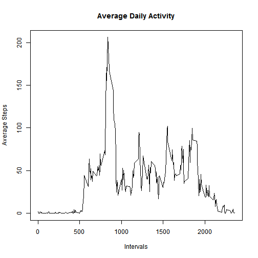

# RepData Peer Assessment 1

## Load data

- Load the data and process/transform the data (if necessary) into a format suitable for your analysis


```r
unzip("activity.zip")
activityData <- read.csv("activity.csv")
activityData$date <- as.Date(activityData$date, format="%Y-%m-%d")
activityData$interval <- as.numeric(activityData$interval)
```

## What is the total number of steps taken per day?

- Make a histogram of the total number of steps taken each day.


```r
totalSteps <- aggregate(steps ~ date, data = activityData, sum, na.rm = TRUE)
hist(totalSteps$steps, main = "Total Number of Steps per Day", 
     xlab = "Steps per Day", ylab = "Frequency", col = "blue" )
```

 

- Calculate and report the mean and median total number of steps taken per day


```r
mean(totalSteps$steps)
```

```
## [1] 10766.19
```

```r
median(totalSteps$steps)
```

```
## [1] 10765
```

## What is the average daily activity pattern?

- Make a time series plot (i.e. type = "l") of the 5-minute interval (x-axis) and the average number of steps taken, averaged across all days (y-axis)


```r
stepsInterval <- aggregate(steps ~ interval, data = activityData, mean,
                           na.rm = TRUE)
plot(steps ~ interval, data = stepsInterval, type = "l", 
     main = "Average Daily Activity", xlab = "Intervals", ylab = "Average Steps")
```

 

- Which 5 minute intervl, on average across all the days in the dataset, contains the maximum number of steps?


```r
stepsInterval[which.max(stepsInterval$steps), ]$interval
```

```
## [1] 835
```

## Imputting missing values

- Calculate and report the total number of missing values in the dataset (i.e. the total number of rows with NAs)


```r
sum(is.na(activityData))
```

```
## [1] 2304
```

- Devise a strategy for filling in all of the missing values in the dataset. The strategy does not need to be sophisticated. For example, you could use the mean/median for that day, or the mean for that 5-minute interval, etc.


```r
intervalSteps <- function(interval){
  stepsInterval[stepsInterval$Interval == interval]$step
}
```

- Create a new dataset that is equal to the original dataset but with the missing data filled in.


```r
dataFilled <- activityData
for(i in 1:nrow(dataFilled)){
  if(is.na(dataFilled[i, ]$steps)){
    dataFilled[i, ]$steps <- intervalSteps(dataFilled[i, ]$interval)
  }
}
```

```
## Error in as.Date.numeric(value): 'origin' must be supplied
```

- Make a histogram of the total number of steps taken each day and Calculate and report the mean and median total number of steps taken per day. Do these values differ from the estimates from the first part of the assignment? What is the impact of imputing missing data on the estimates of the total daily number of steps?


```r
dataFilled2 <- aggregate(steps ~ date, data = dataFilled, sum)
hist(dataFilled2$steps, main = "Histogram of Steps per Day", 
     xlab = "Steps per Day", ylab = "Frequency", col = "blue")
```

 

```r
mean(dataFilled2$steps)
```

```
## [1] 10766.19
```

```r
median(dataFilled2$steps)
```

```
## [1] 10765
```

Imputting missing data on the estimates did not effect the mean or median.

## Are there differences in activity data between weekdays and weekends.  
  
  -    Create a new factor variable in the dataset with two levels - "weekday" and "weekend" indicating whether a given date is a weekday or weekend day then make a panel plot containing a time series plot (i.e. type = "l") of the 5minute interval (x-axis) and the average number of steps taken, averaged across all weekday days or weekend days (y-axis). The plot should look something like the following, which was creating using simulated data:


```r
dataFilled$day = ifelse(as.POSIXlt(as.Date(dataFilled$date))$wday%%6 == 
                              0, "weekend", "weekday")

dataFilled$day = factor(dataFilled$day, levels = c("weekday", "weekend"))
intervalSteps = aggregate(steps ~ interval + day, dataFilled, mean)
library(lattice)
xyplot(steps ~ interval | factor(day), data = intervalSteps, aspect = 1/2, 
       type = "l")
```

 

